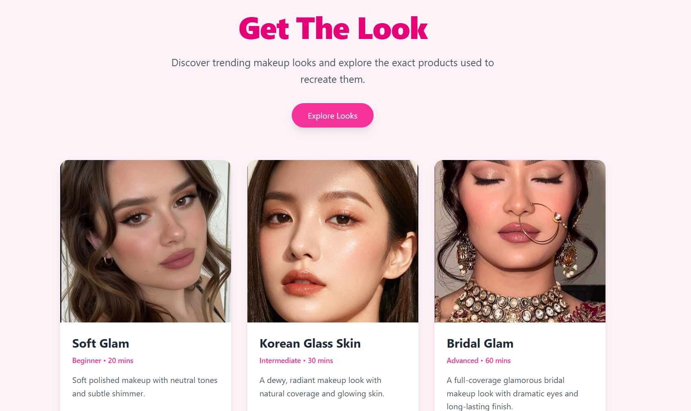
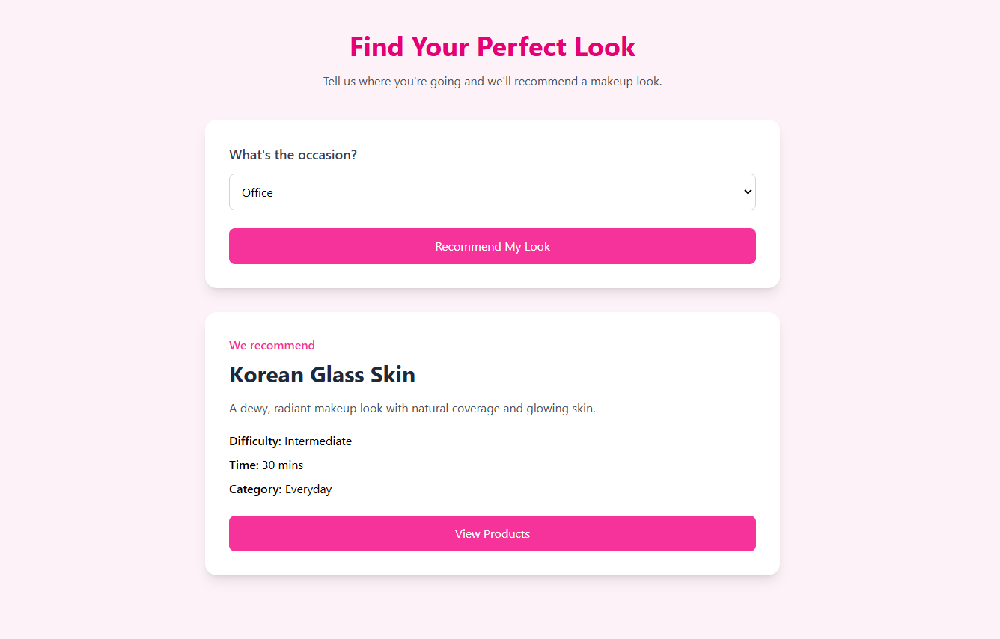
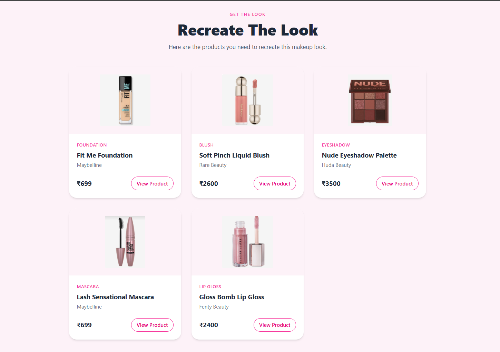

\#  Get The Look


A full-stack makeup discovery and recommendation application that helps users explore makeup looks and discover the products needed to recreate them.


\##  Overview


\*\*Get The Look\*\* connects a React frontend with a Spring Boot REST API and MySQL database.


Users can browse makeup looks, explore the products associated with each look, view individual product details, and get makeup recommendations through the application.


This project was built to understand how a frontend, backend, REST APIs, and database work together as a complete full-stack application.


\##  Features


\*  Browse curated makeup looks

\*  Explore makeup products

\*  View products associated with individual makeup looks

\*  Get makeup look recommendations

\*  Responsive React interface

\*  Frontend communication with backend REST APIs

\*  Persistent application data using MySQL

\*  RESTful backend architecture using Spring Boot


\##  Architecture


```text

React + Vite Frontend

&#x20;       │

&#x20;       │ HTTP / REST API

&#x20;       ▼

Spring Boot Backend

&#x20;       │

&#x20;       │ JPA / Hibernate

&#x20;       ▼

&#x20;    MySQL Database

```


The frontend is responsible for the user interface and user interactions.


The Spring Boot backend exposes REST APIs and handles application logic and database communication.


MySQL stores the application's makeup looks and product data.


##  Application Preview

### Home — Explore Makeup Looks

Users can browse different makeup looks and explore the products required to recreate them.



### Makeup Look Recommendation

Users can select an occasion and receive a recommended makeup look.



### Recreate The Look

Each makeup look is connected to the products needed to recreate it, including product name, brand, category, and price.




\##  Tech Stack


\### Frontend


\* React

\* Vite

\* Tailwind CSS

\* React Router

\* Axios

\* JavaScript


\### Backend


\* Java

\* Spring Boot

\* Spring Data JPA

\* Hibernate

\* Spring Validation

\* Maven


\### Database


\* MySQL


\### Development Tools


\* Git

\* GitHub

\* Postman

\* IntelliJ IDEA

\* VS Code


\##  Project Structure


```text

get-the-look/

│

├── frontend/

│   ├── public/

│   ├── src/

│   │   ├── components/

│   │   ├── pages/

│   │   ├── services/

│   │   ├── App.jsx

│   │   └── main.jsx

│   ├── package.json

│   └── vite.config.js

│

├── src/

│   └── main/

│       ├── java/

│       │   └── com/poorvi/get\_the\_look\_backend/

│       │       ├── controller/

│       │       ├── dto/

│       │       ├── entity/

│       │       ├── repository/

│       │       └── service/

│       │

│       └── resources/

│           └── application.properties

│

├── pom.xml

├── .gitignore

├── mvnw

└── README.md

```


\##  REST API


The Spring Boot backend provides APIs for working with makeup looks and products.


\### Makeup Looks


```text

GET /makeup-looks

```


Retrieves the available makeup looks.


\### Products


The backend provides endpoints for retrieving and working with product information.


\### Recommendations


The application also provides recommendation functionality that connects makeup looks with relevant products.


The APIs can be tested locally using \*\*Postman\*\*.


\##  Running Locally


\### Prerequisites


Make sure you have:


\* Java 21+

\* Maven

\* Node.js and npm

\* MySQL


\### 1. Clone the repository


```bash

git clone https://github.com/poorvitiw/get-the-look-backend.git

cd get-the-look-backend

```


\### 2. Configure MySQL


Create a MySQL database for the application.


```sql

CREATE DATABASE get\_the\_look;

```


Configure your local database credentials using environment variables rather than committing passwords to GitHub.


Example:


```text

MYSQLUSER=your\_mysql\_username

MYSQLPASSWORD=your\_mysql\_password

```


\### 3. Start the backend


From the repository root:


```bash

./mvnw spring-boot:run

```


On Windows:


```powershell

.\\mvnw.cmd spring-boot:run

```


The backend runs on:


```text

http://localhost:8080

```


\### 4. Start the frontend


Open another terminal:


```powershell

cd frontend

npm install

npm run dev

```


Vite will provide the local frontend URL in the terminal.


\##  Environment Variables


Sensitive credentials are kept outside the repository using environment variables.


The project `.gitignore` prevents environment files and local configuration containing secrets from being committed.


Never commit database passwords, API keys, or other credentials to GitHub.


\##  Deployment


The application is being prepared for deployment with the frontend and backend maintained in the same repository.


The backend is configured to use environment variables so that local MySQL credentials can be replaced with deployment database credentials without exposing secrets in source code.


\##  What I Learned


Building Get The Look helped me understand how the different layers of a full-stack application connect.


Through the project, I worked with:


\* Building REST APIs with Spring Boot

\* Connecting Spring Boot with MySQL using JPA/Hibernate

\* Structuring backend code using controllers, services, repositories, entities, and DTOs

\* Connecting a React frontend to backend APIs using Axios

\* Managing frontend routing with React Router

\* Handling environment variables and application configuration

\* Using Git and GitHub for version control

\* Testing APIs with Postman

\* Preparing a full-stack application for deployment


\##  Author


\*\*Poorvi Tiwari\*\*


Built as a learning and portfolio project while exploring full-stack development with Java and React.


\---


If you found the project interesting, feel free to explore the code and follow the development journey.


